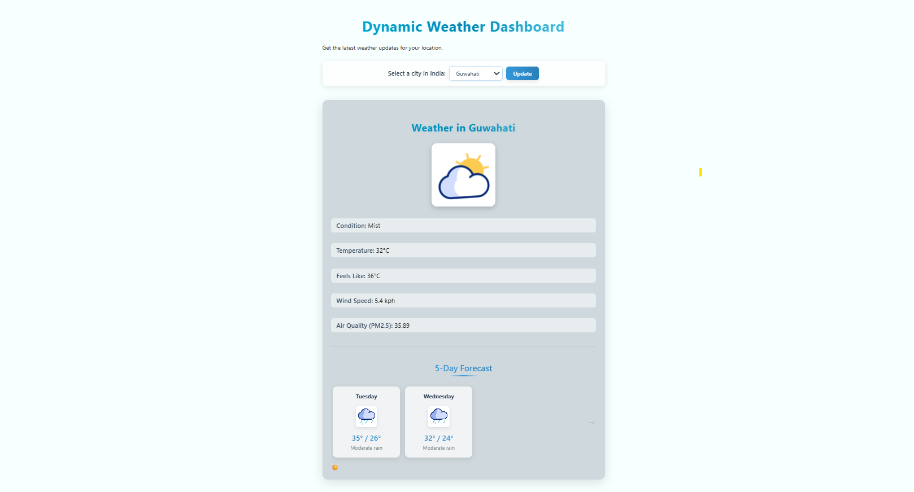

# Dynamic Weather Dashboard

A beautiful and responsive weather application that displays current weather conditions and a 5-day forecast for cities in India. The app features dynamic backgrounds that change based on weather conditions and time of day.

## Features

- Current weather conditions display
- 2-day weather forecast
- Dynamic video backgrounds based on weather conditions
- City selector for major Indian cities
- Responsive design that works on mobile and desktop
- Air quality information
- Day/night mode that changes automatically

## Setup

1. Clone this repository
2. Copy `config.example.js` to `config.js`
3. Get a free API key from [WeatherAPI.com](https://www.weatherapi.com/)
4. Add your API key to the `config.js` file
5. Open `index.html` in your browser

## Configuration

The app can be configured by editing the `config.js` file:

- `WEATHER_API_KEY`: Your API key from WeatherAPI.com
- `DEFAULT_CITY`: The default city to show weather for
- `API_BASE_URL`: The base URL for the WeatherAPI
- `INDIAN_CITIES`: List of cities available in the dropdown selector

## Technologies Used

- HTML5
- CSS3 (with modern features like CSS Grid, Flexbox, and animations)
- Vanilla JavaScript
- [WeatherAPI.com](https://www.weatherapi.com/) for weather data

## Screenshots

## License

MIT License - Feel free to use and modify for your own projects.
